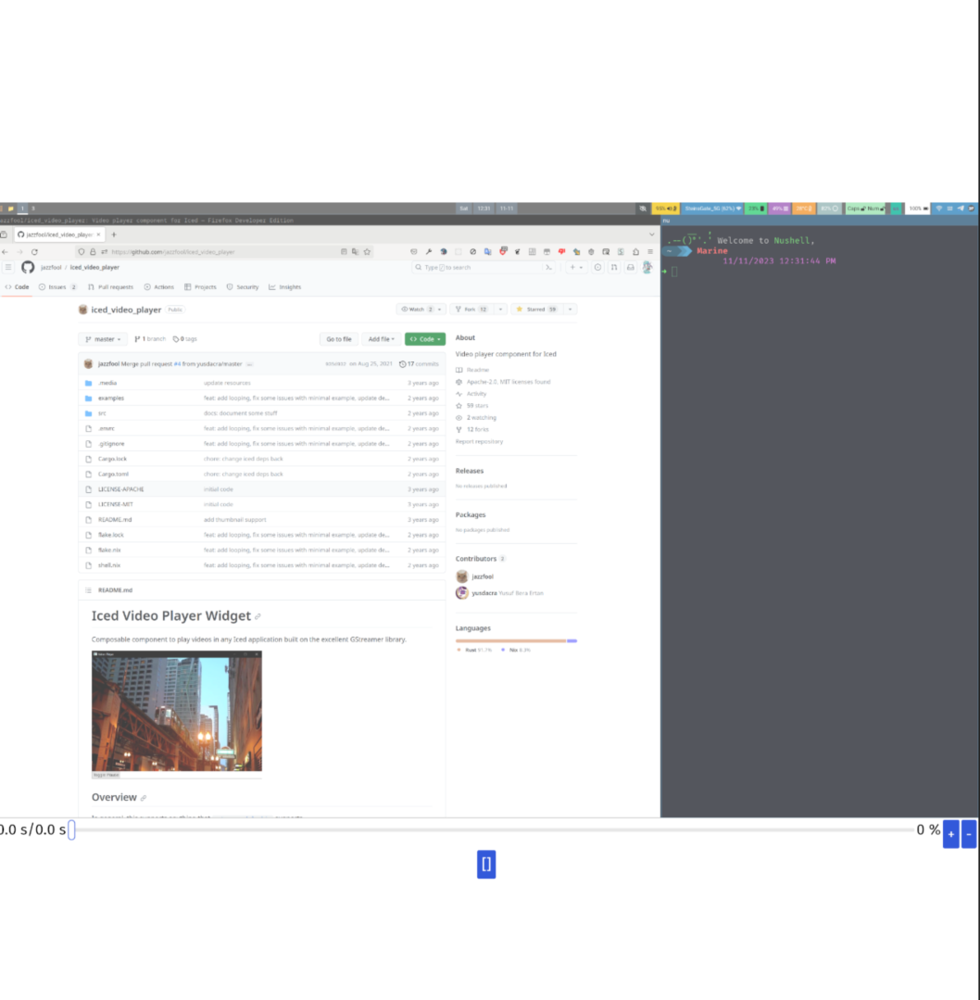

# GStreamer iced

## Support GStreamer on video play and pipewire record

It is a simple binding for GStreamer, for video player and pipewire record.



There are two examples under examples folder, you can take them as a look. Most code is from `iced_video_player`, I learn a lot

## Simple start

### play bin

```rust
use gstreamer_iced::*;
use iced::widget::container;
use iced::widget::{button, column, row, slider, text};
use iced::{Element, Length};
use std::time::Duration;

fn main() -> iced::Result {
    iced::application(GProgram::new, GProgram::update, GProgram::view)
        .title(GProgram::title)
        .run()
}

#[derive(Debug)]
struct GProgram {
    video: GVideo,
    duration: Duration,
    position: Duration,
    state: gstreamer::State,
}
#[derive(Debug, Clone)]
enum GIcedMessage {
    Jump(u8),
    VolChange(f64),
    RequestStateChange(PlayingState),
    DurationChanged(Duration),
    PositionChanged(Duration),
    StateChanged(gstreamer::State),
}

impl GProgram {
    fn view(&'_ self) -> iced::Element<'_, GIcedMessage> {
        let fullduration = self.duration.as_secs_f64();
        let current_pos = self.position.as_secs_f64();
        let duration = (fullduration / 8.0) as u8;
        let pos = (current_pos / 8.0) as u8;

        let btn: Element<GIcedMessage> =
            match self.state {
                PlayingState::Playing => button(text("[]"))
                    .on_press(GIcedMessage::RequestStateChange(PlayingState::Paused)),
                _ => button(text("|>"))
                    .on_press(GIcedMessage::RequestStateChange(PlayingState::Playing)),
            }
            .into();
        let video = VideoPlayer::new(&self.video)
            .on_position_changed(GIcedMessage::PositionChanged)
            .on_duration_changed(GIcedMessage::DurationChanged)
            .on_state_changed(GIcedMessage::StateChanged)
            .width(Length::Fill);

        let pos_status = text(format!("{:.1} s/{:.1} s", current_pos, fullduration));
        let du_silder = slider(0..=duration, pos, GIcedMessage::Jump);

        let add_vol = button(text("+")).on_press(GIcedMessage::VolChange(0.1));
        let min_vol = button(text("-")).on_press(GIcedMessage::VolChange(-0.1));
        let volcurrent = self.video.as_url().volume() * 100.0;

        let voicetext = text(format!("{:.0} %", volcurrent));

        let duration_component = row![pos_status, du_silder, voicetext, add_vol, min_vol]
            .spacing(2)
            .padding(2)
            .width(Length::Fill);

        container(column![
            video,
            duration_component,
            container(btn).width(Length::Fill).center_x(Length::Fill)
        ])
        .width(Length::Fill)
        .height(Length::Fill)
        .center_x(Length::Fill)
        .center_y(Length::Fill)
        .into()
    }

    fn update(&mut self, message: GIcedMessage) -> iced::Task<GIcedMessage> {
        match message {
            GIcedMessage::Jump(step) => {
                self.video
                    .as_url()
                    .seek(std::time::Duration::from_secs(step as u64 * 8))
                    .unwrap();
                iced::Task::none()
            }
            GIcedMessage::DurationChanged(duration) => {
                self.duration = duration;
                iced::Task::none()
            }
            GIcedMessage::PositionChanged(position) => {
                self.position = position;
                iced::Task::none()
            }
            GIcedMessage::RequestStateChange(status) => {
                self.video.set_state(status);
                iced::Task::none()
            }
            GIcedMessage::VolChange(vol) => {
                let currentvol = self.video.as_url().volume();
                let newvol = currentvol + vol;
                if newvol >= 0.0 {
                    self.video.as_url().set_volume(newvol);
                }
                iced::Task::none()
            }
            GIcedMessage::StateChanged(state) => {
                self.state = state;
                iced::Task::none()
            }
        }
    }

    fn title(&self) -> String {
        "Iced Gstreamer".to_string()
    }

    fn new() -> Self {
        let url = url::Url::parse(
            "http://commondatastorage.googleapis.com/gtv-videos-bucket/sample/TearsOfSteel.mp4",
        )
        .unwrap();
        let video = GVideo::new_url(url, false).build().unwrap();

        Self {
            state: video.play_state(),
            video,
            duration: Default::default(),
            position: Default::default(),
        }
    }
}

```

### For pipewire

```rust
use ashpd::desktop::{
    screencast::{CursorMode, Screencast, SelectSourcesOptions, SourceType},
    PersistMode,
};
use iced::widget::container;
use iced::widget::{button, column, text};
use iced::Length;
use iced::Task;
use std::os::fd::{AsRawFd, OwnedFd};
use std::sync::Arc;

use gstreamer_iced::*;

async fn get_path() -> ashpd::Result<(u32, Arc<OwnedFd>)> {
    let proxy = Screencast::new().await?;
    let session = proxy.create_session(Default::default()).await?;
    proxy
        .select_sources(
            &session,
            SelectSourcesOptions::default()
                .set_cursor_mode(CursorMode::Embedded)
                .set_sources(SourceType::Monitor | SourceType::Window | SourceType::Virtual)
                .set_multiple(false)
                .set_restore_token(None)
                .set_persist_mode(PersistMode::DoNot),
        )
        .await?;

    let response = proxy
        .start(&session, None, Default::default())
        .await?
        .response()?;

    let stream = response
        .streams()
        .first()
        .expect("No stream found or selected")
        .to_owned();
    let path = stream.pipe_wire_node_id();

    let fd = proxy
        .open_pipe_wire_remote(&session, Default::default())
        .await?;

    Ok((path, Arc::new(fd)))
}
fn main() -> iced::Result {
    iced::application(GProgram::new, GProgram::update, GProgram::view)
        .title(GProgram::title)
        .run()
}

struct GProgram {
    video: GVideo,
    fd: Option<Arc<OwnedFd>>,
    state: gstreamer::State,
}

#[derive(Debug, Clone)]
enum GIcedMessage {
    Ready((u32, Arc<OwnedFd>)),
    StopRecording,
    StateChanged(gstreamer::State),
}

impl GProgram {
    fn view(&'_ self) -> iced::Element<'_, GIcedMessage> {
        let btn = button(text("[]")).on_press_maybe(if self.state == PlayingState::Playing {
            Some(GIcedMessage::StopRecording)
        } else {
            None
        });

        let video = VideoPlayer::new(&self.video)
            .on_state_changed(GIcedMessage::StateChanged)
            .width(Length::Fill);

        container(column![
            video,
            container(btn).width(Length::Fill).center_x(Length::Fill)
        ])
        .width(Length::Fill)
        .height(Length::Fill)
        .center_x(Length::Fill)
        .center_y(Length::Fill)
        .into()
    }

    fn update(&mut self, message: GIcedMessage) -> iced::Task<GIcedMessage> {
        match message {
            GIcedMessage::StopRecording => {
                self.video.as_pw().stop_recording();
                Task::none()
            }
            GIcedMessage::StateChanged(state) => {
                self.state = state;
                Task::none()
            }
            GIcedMessage::Ready((path, fd)) => {
                self.fd = Some(fd.clone());
                self.video
                    .open_pipewire(path, fd.as_raw_fd())
                    .finish()
                    .unwrap();
                self.state = self.video.play_state();
                Task::none()
            }
        }
    }

    fn title(&self) -> String {
        "Iced Gstreamer".to_string()
    }

    fn new() -> (Self, iced::Task<GIcedMessage>) {
        let video = GVideo::empty();
        (
            Self {
                fd: None,
                state: video.play_state(),
                video,
            },
            iced::Task::perform(async { get_path().await.unwrap() }, GIcedMessage::Ready),
        )
    }
}

```

## Ref

- https://github.com/jazzfool/iced_video_player/
