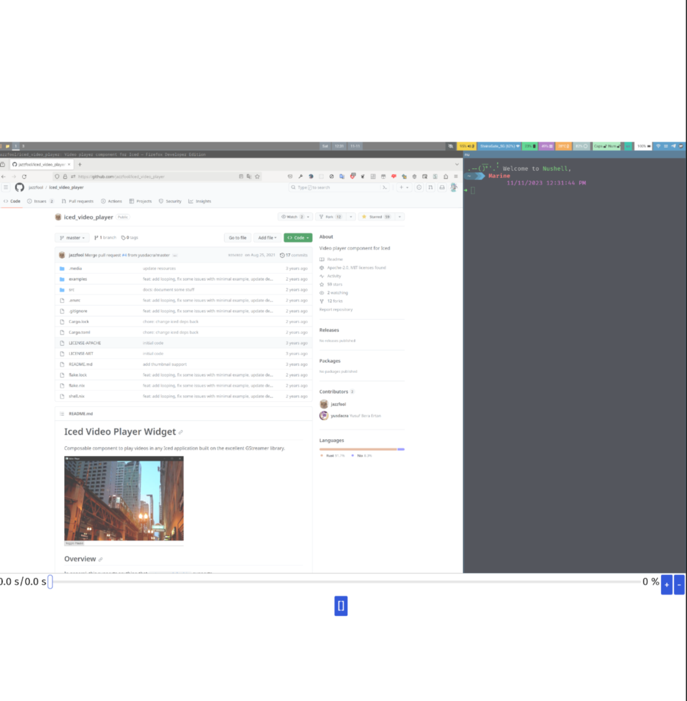

# GStreamer train

## Support GStreamer on video play and pipewire record

It is a simple binding for GStreamer, for video player and pipewire record.



There are two examples under examples folder, you can take them as a look. Most code is from `iced_video_player`, I learn a lot

## Simple start

```rust
use iced::widget::{button, column, row, slider, text, Image};
use iced::{executor, widget::container, Application, Theme};
use iced::{Command, Element, Length, Settings};

use gstreamer_iced::*;

#[derive(Debug, Default)]
static MEDIA_PLAYER: &[u8] = include_bytes!("resource/popandpipi.jpg");

struct InitFlage {
    url: Option<url::Url>,
}

fn main() -> iced::Result {
    GstreamerIcedProgram::run(Settings {
        flags: InitFlage {
            url: Some(
                url::Url::parse(
                    "http://commondatastorage.googleapis.com/gtv-videos-bucket/sample/TearsOfSteel.mp4",
                    //"https://gstreamer.freedesktop.org/data/media/sintel_trailer-480p.webm",
                )
                .unwrap(),
            ),
        },
        ..Settings::default()
    })
}

#[derive(Debug)]
struct GstreamerIcedProgram {
    frame: GstreamerIced,
}
#[derive(Debug, Clone, Copy)]
enum GStreamerIcedMessage {
    Gst(GStreamerMessage),
    Jump(u8),
    VolChange(f64),
}

#[derive(Debug, Clone, Copy)]
struct GstreamerUpdate;

impl Application for GstreamerIcedProgram {
    type Theme = Theme;
    type Flags = InitFlage;
    type Executor = executor::Default;
    type Message = GStreamerIcedMessage;

    fn view(&self) -> iced::Element<Self::Message> {
        let frame = self
            .frame
            .frame_handle()
            .unwrap_or(image::Handle::from_memory(MEDIA_PLAYER));
        let fullduration = self.frame.duration_seconds();
        let current_pos = self.frame.position_seconds();
        let duration = (fullduration / 8.0) as u8;
        let pos = (current_pos / 8.0) as u8;

        let btn: Element<Self::Message> = match self.frame.play_status() {
            PlayStatus::Stop | PlayStatus::End => button(text("|>")).on_press(
                GStreamerIcedMessage::Gst(GStreamerMessage::PlayStatusChanged(PlayStatus::Playing)),
            ),
            PlayStatus::Playing => button(text("[]")).on_press(GStreamerIcedMessage::Gst(
                GStreamerMessage::PlayStatusChanged(PlayStatus::Stop),
            )),
        }
        .into();
        let video = Image::new(frame).width(Length::Fill);

        let pos_status = text(format!("{:.1} s/{:.1} s", current_pos, fullduration));
        let du_silder = slider(0..=duration, pos, GStreamerIcedMessage::Jump);

        let add_vol = button(text("+")).on_press(GStreamerIcedMessage::VolChange(0.1));
        let min_vol = button(text("-")).on_press(GStreamerIcedMessage::VolChange(-0.1));
        let volcurrent = self.frame.volume() * 100.0;

        let voicetext = text(format!("{:.0} %", volcurrent));

        let duration_component = row![pos_status, du_silder, voicetext, add_vol, min_vol]
            .spacing(2)
            .padding(2)
            .width(Length::Fill);

        container(column![
            video,
            duration_component,
            container(btn).width(Length::Fill).center_x()
        ])
        .width(Length::Fill)
        .height(Length::Fill)
        .center_x()
        .center_y()
        .into()
    }

    fn update(&mut self, message: Self::Message) -> iced::Command<Self::Message> {
        match message {
            GStreamerIcedMessage::Gst(message) => {
                self.frame.update(message).map(GStreamerIcedMessage::Gst)
            }
            GStreamerIcedMessage::Jump(step) => {
                self.frame
                    .seek(std::time::Duration::from_secs(step as u64 * 8))
                    .unwrap();
                Command::perform(
                    async { GStreamerMessage::Update },
                    GStreamerIcedMessage::Gst,
                )
            }
            GStreamerIcedMessage::VolChange(vol) => {
                let currentvol = self.frame.volume();
                let newvol = currentvol + vol;
                if newvol >= 0.0 {
                    self.frame.set_volume(newvol);
                }
                Command::perform(
                    async { GStreamerMessage::Update },
                    GStreamerIcedMessage::Gst,
                )
            }
        }
    }

    fn title(&self) -> String {
        "Iced Gstreamer".to_string()
    }

    fn subscription(&self) -> iced::Subscription<Self::Message> {
        self.frame.subscription().map(GStreamerIcedMessage::Gst)
    }

    fn new(flags: Self::Flags) -> (Self, Command<Self::Message>) {
        let frame = GstreamerIced::new_url(flags.url.as_ref().unwrap(), false).unwrap();

        (Self { frame }, Command::none())
    }
}
```


## Ref

- https://github.com/jazzfool/iced_video_player/
